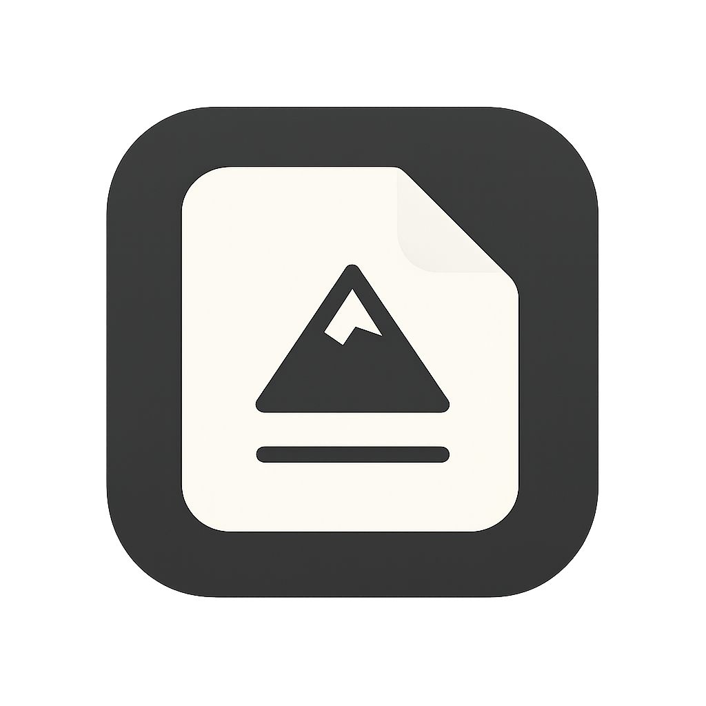
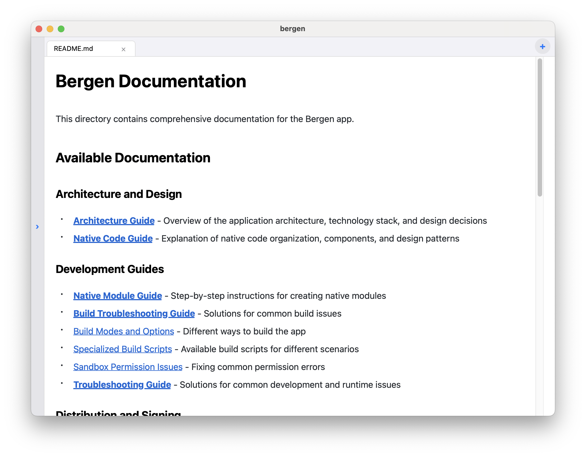

# Bergen
<div align="center">




[](https://github.com/kkarimi/bergen/releases)
[](LICENSE)
[](https://github.com/kkarimi/bergen/stargazers)
[](http://makeapullrequest.com)

<br />

<br />


*A minimal Markdown reader*

• [Getting Started](#getting-started) 
• [Features](#features) 
• [Installation](#installation) 
• [Usage](#usage) 
• [Contributing](#contributing)

<!-- 
coming soon! 

-->
</div>

## ✨ Features

- 🎨 **Clean, elegant UI** that adapts to both light and dark mode
- 📁 **File system navigation** with a convenient sidebar
- 📝 **Markdown rendering** with proper formatting
- 📊 **Mermaid diagram support** for visualizing flowcharts and diagrams
- ℹ️ **File information panel** displaying detailed file metadata
- 📄 **Git integration** showing repository status and commit details
- 🖥️ **macOS-native look and feel** designed specifically for desktop

## 🚀 Getting Started

### 📥 Download

<div align="center">
  <a href="https://github.com/kkarimi/bergen/releases/latest/download/bergen-macos-v0.1.17.zip">
    
  </a>
</div>

> Always links to the latest release zip file!

You can also browse all releases [here](https://github.com/kkarimi/bergen/releases).

### 📦 Installation

### Homebrew

```bash
# Install using the custom tap (recommended)
brew tap kkarimi/bergen
brew install kkarimi/bergen/bergen
```

### Manual Installation

Download the latest release from [GitHub Releases](https://github.com/kkarimi/bergen/releases).

### Building from source

#### Prerequisites


- Node.js (>= 18)
- macOS
- Xcode (latest version recommended)
- CocoaPods

1. Clone the repository
   ```bash
   git clone https://github.com/kkarimi/bergen.git
   cd bergen
   ```

2. Install JavaScript dependencies
   ```bash   
   yarn install
   ```

3. Install pod dependencies
   ```bash
   cd macos && pod install
   ```

### 🏃‍♂️ Running the App

```bash
# Start the app
yarn macos
```

## 📖 Usage

1. Use the sidebar to navigate through your file system
2. Click on any markdown (.md) file to preview it
3. Use the "Open File" button to navigate to a specific location
4. Click the info (ℹ️) button in the tab bar to view detailed file information
5. The app automatically renders markdown formatting and Mermaid diagrams

## 🛠️ Built With

[](https://reactnative.dev/)
[](https://www.typescriptlang.org/)
[](https://mermaid-js.github.io/mermaid/)

- [React Native macOS](https://microsoft.github.io/react-native-windows/docs/rnm-getting-started) - macOS platform support
- [React Native WebView](https://github.com/react-native-webview/react-native-webview) - For rendering markdown content
- [React Native FS](https://github.com/itinance/react-native-fs) - For file system operations

## 📚 Documentation

Comprehensive documentation is available in the [docs](/docs) directory:

- [Architecture Guide](/docs/architecture.md) - High-level application architecture
- [Native Code Guide](/docs/native-code-guide.md) - macOS native code organization
- [Native Module Guide](/docs/native-module-guide.md) - Creating new native modules

## 🤝 Contributing

Contributions are what make the open source community such an amazing place to learn, inspire, and create. Any contributions you make are **greatly appreciated**.

1. Fork the Project
2. Create your Feature Branch (`git checkout -b feature/AmazingFeature`)
3. Commit your Changes (`git commit -m 'Add some AmazingFeature'`)
4. Push to the Branch (`git push origin feature/AmazingFeature`)
5. Open a Pull Request

### 📦 Creating a Release

The project uses semantic versioning ([semver](https://semver.org/)) with version format `major.minor.patch`. The initial version starts at `0.0.1`.

To create a new release:

```bash
# Default: bump patch version (e.g., 0.0.1 -> 0.0.2)
yarn release

# Bump minor version (e.g., 0.0.1 -> 0.1.0)
yarn release --bump-type minor

# Bump major version (e.g., 0.0.1 -> 1.0.0)
yarn release --bump-type major
```

The release script will:
1. Bump the version in package.json
2. Create a version commit
3. Build the macOS app
4. Create a draft GitHub release
5. Upload the binary

After running the script, review and publish the release from the GitHub web interface.

## 📄 License

This project is licensed under the MIT License - see the [LICENSE](LICENSE) file for details

## 🙏 Acknowledgments

- Inspired by various markdown editors and viewers
- macOS design guidelines

---

<div align="center">
Made with ❤️ by <a href="https://github.com/kkarimi">Nima</a>
</div>
