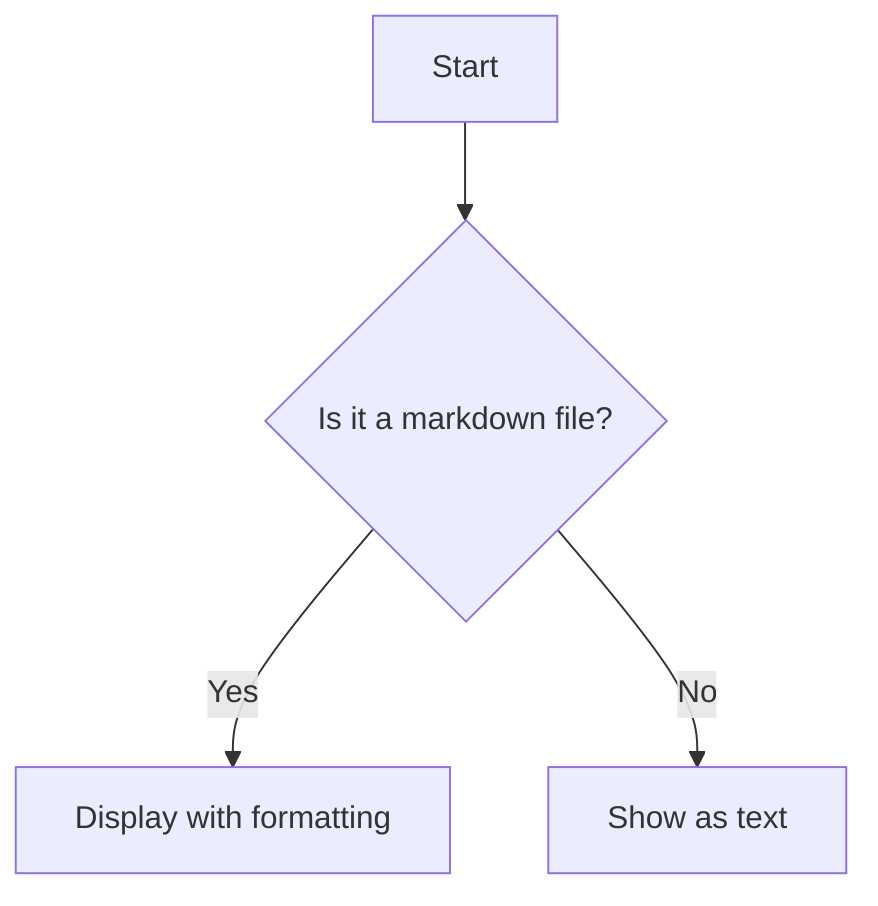
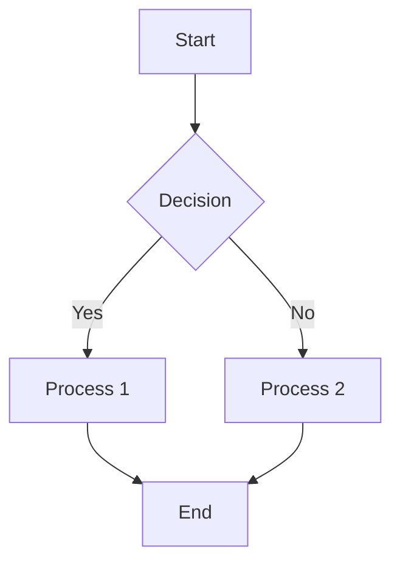
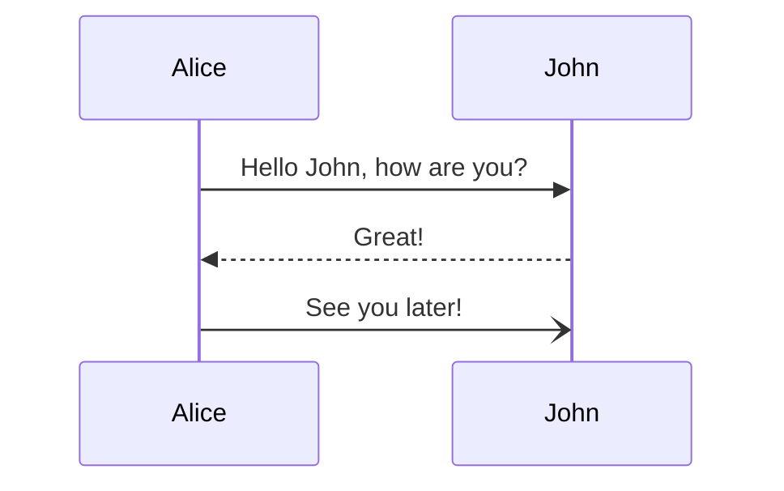
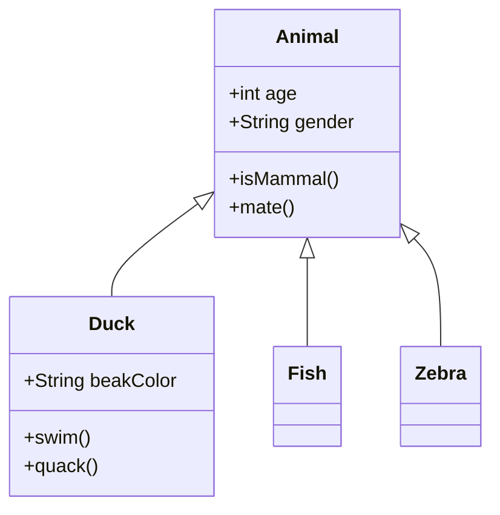
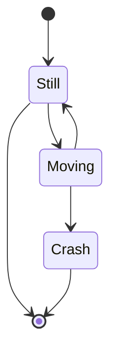
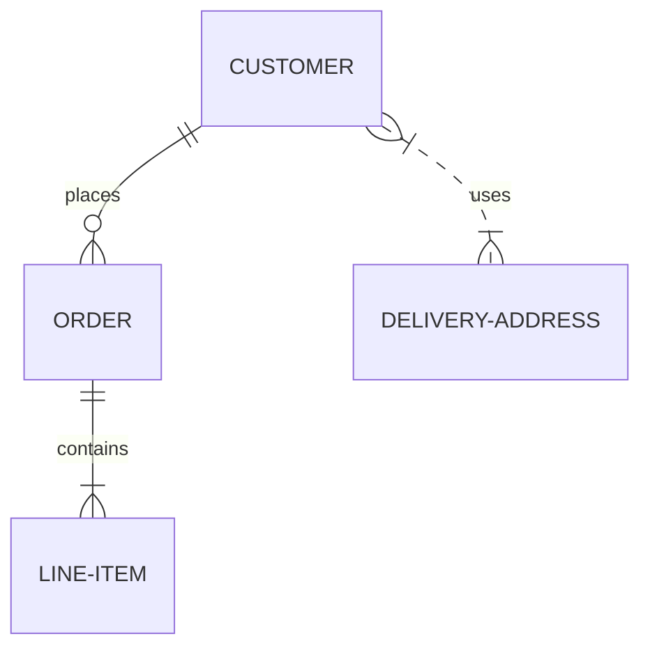
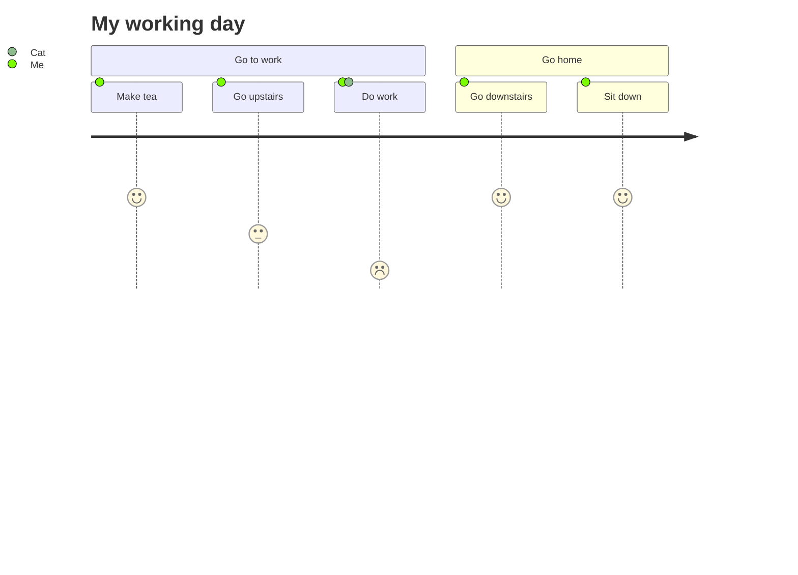

# Mermaid Diagram Support in Bergen

Bergen now supports Mermaid diagrams in markdown files. This guide explains how to use this feature.

## What is Mermaid?

Mermaid is a JavaScript-based diagramming and charting tool that renders text-based diagram definitions into visual diagrams. It's similar to Markdown in that it uses a simple syntax to create visualizations.

## Using Mermaid in Bergen

To add a Mermaid diagram to your markdown files:

1. Create a code block with language set to "mermaid"
2. Write your diagram definition using Mermaid syntax
3. Close the code block

Example:

````markdown

````

## Supported Diagram Types

Bergen supports all standard Mermaid diagram types, including:

### Flowcharts



### Sequence Diagrams



### Class Diagrams



### State Diagrams



### Entity Relationship Diagrams



### User Journey Diagram



## Implementation Notes

- Diagrams automatically adapt to the system's light/dark mode setting
- Bergen uses WebView with mermaid.js to render diagrams
- Internet connection is required for rendering (mermaid.js is loaded from CDN)
- Large or complex diagrams may take longer to render

## Troubleshooting

If your diagram doesn't render properly:

1. Check your syntax against the [Mermaid documentation](https://mermaid.js.org/syntax/flowchart.html)
2. Ensure your code block is properly formatted with triple backticks and "mermaid" language
3. Make sure you have an internet connection for the CDN resources

## Further Resources

- [Official Mermaid Documentation](https://mermaid.js.org/intro/)
- [Mermaid Live Editor](https://mermaid.live/)