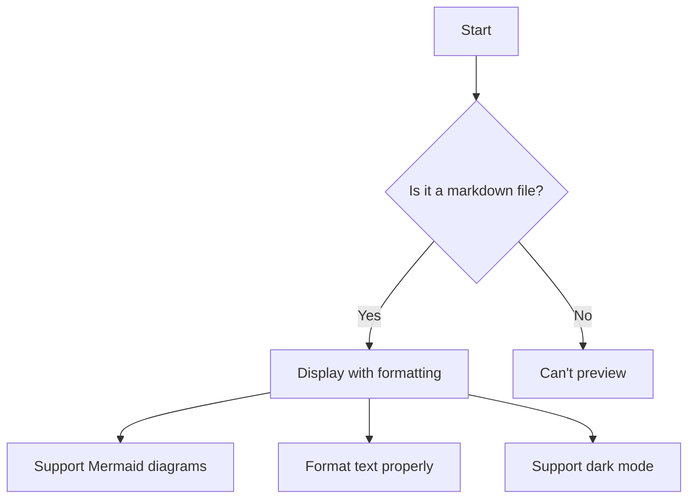

# Welcome to Bergen Markdown Viewer

This is a beautiful, minimal Markdown viewer for macOS built with React Native.

## Features

- **File Browser**: Navigate through your files and directories
- **Markdown Preview**: View markdown files with proper formatting
- **Dark Mode Support**: Automatically adapts to your system preferences
- **Mermaid Diagram Support**: Renders mermaid diagrams in your markdown

## Mermaid Demo



## Basic Markdown Examples

### Text Formatting

This is **bold text** and this is *italic text*.

### Lists

Unordered list:
- Item 1
- Item 2
- Item 3

Ordered list:
1. First item
2. Second item
3. Third item

### Code

Inline code: `const app = 'bergen'`

Code block:
```javascript
function greet() {
  console.log('Hello, Bergen!');
}
```

### Links

[Visit React Native website](https://reactnative.dev/)

## Getting Started

1. Navigate through your directories using the sidebar
2. Select any .md file to preview it
3. The preview will automatically render markdown formatting
4. Dark mode is supported based on your system settings

Enjoy using Bergen Markdown Viewer!